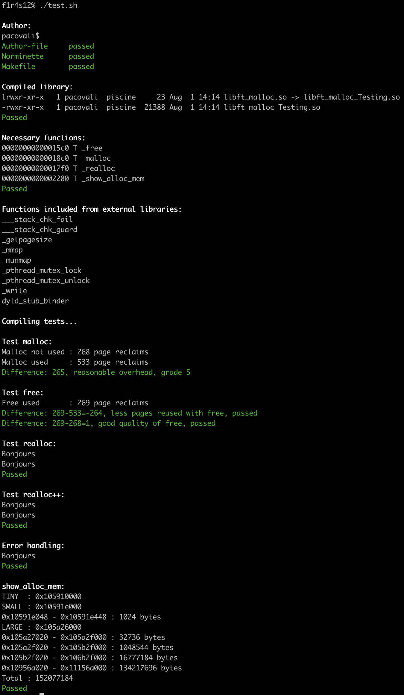

# malloc
An Algo Project at Codam (42). This project is about implementing a dynamic memory allocation mechanism.

## Description

This mini project is about writing a dynamic allocation memory management library. [Complete Subject](SUBJECT.pdf)

Use [Evaluation sheet](https://github.com/k-off/malloc/wiki/Evaluation-Sheet) or [Test](test)

### Restrictions
Functions allowed for use:
```
mmap(2)
munmap(2)
getpagesize(3)
getrlimit(2)
write(2)
```
Project must be written according to the 42 coding standards, the `Norme`.

### Requirements
Rewrite the following functions:
```
void       free(void *ptr);
void       *malloc(size_t size);
void       *realloc(void *ptr, size_t size);
```
[malloc man page](https://man7.org/linux/man-pages/man3/malloc.3.html)

 - allocations must belong to 3 different memory areas depending on allocation size (`TINY`, `SMALL`, `LARGE`)
 - `TINY` and `SMALL` areas must be preallocated and must have enough space for at least 100 allocations
 
 Write the following function:
```
void      show_alloc_mem();
```
It's output must be formatted as follows:
```
TINY : 0xA0000
0xA0020 - 0xA004A : 42 bytes
0xA006A - 0xA00BE : 84 bytes
SMALL : 0xAD000
0xAD020 - 0xADEAD : 3725 bytes
LARGE : 0xB0000
0xB0020 - 0xBBEEF : 48847 bytes
Total : 52698 bytes
```

### Bonus part
Extra functionality:
  - "defragment” the freed memory
  - `void show_alloc_mem_ex(int mode);` - function that displays more details depending on `mode` passed as argument:
    - `SHRT` - short mode, the same output as for `show_alloc_mem`
    - `STD` - standard mode, outputs block metadata
    - `EXT` - extended mode, outputs hex dump of memory stored in the `data` area of the block

# Usage
 - clone repository
 - if you don't have `norminette` installed on your device, comment out lines 29-36 in the file `test/test.sh`
```
cd test
sh test.sh
```

